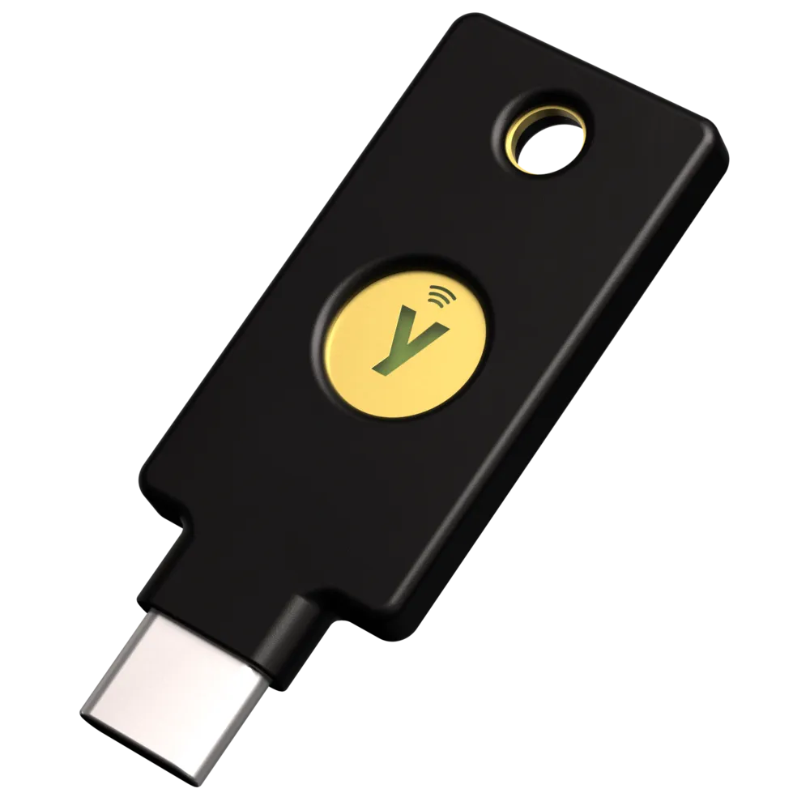

# YubiKey Leitfaden
## Installation & Verwendung

<p style="margin-top: 1.5em;">Basierend auf <a href="https://github.com/drduh/YubiKey-Guide">Dr. Duh's YubiKey Guide</a></p>

<div style="display: flex; justify-content: center; gap: 3em; margin-top: 2em;">
    <div style="text-align: center;">
        
        <p style="font-size: 1.2em; margin-top: 1em;">YubiKey 5C Nano</p>
    </div>
    <div style="text-align: center;">
        
        <p style="font-size: 1.2em; margin-top: 1em;">YubiKey 5C NFC</p>
    </div>
</div>

---

# Agenda

1. Neuen Key installieren
2. GPG Zertifikat
3. SSH per GPG einrichten
4. ZEIT Dienste mit Yubikey authentifizieren
5. TOTP, Password Store

---

## GPG Schlüsselverwaltung

<div style="display: flex; justify-content: space-between; align-items: flex-start; gap: 1.5em; font-size: 1.6em;">
    <div style="display: flex; gap: 1.5em; flex: 1;">
        <!-- Links: Air-Gapped Master Key -->
        <div style="flex: 1; text-align: center; padding: 0.8em; background: rgba(76, 175, 80, 0.1); border-radius: 10px;">
            <div style="font-size: 2em; margin-bottom: 0.2em;">🔐</div>
            <h3 style="font-size: 1.9em; margin: 0.2em 0;">Main Key ∞</h3>
            <p style="font-size: 1.3em; margin: 0.3em 0; line-height: 1.6;">💿 Live-CD<br/>💾 USB-Sticks<br/>🏡 Sicher<br/>🚫🌐 Offline</p>
            <p style="font-size: 1.1em; margin: 0.3em 0; color: #666; font-style: italic;">Stufe 7</p>
        </div>
        
        <!-- Pfeil -->
        <div style="display: flex; align-items: center; font-size: 2em; color: #666;">
            →
        </div>
        
        <!-- Rechts: IT Arbeitsrechner mit YubiKey -->
        <div style="flex: 1; text-align: center; padding: 0.8em; background: rgba(33, 150, 243, 0.1); border-radius: 10px;">
            <div style="font-size: 2em; margin-bottom: 0.2em;">🔑</div>
            <h3 style="font-size: 1.9em; margin: 0.2em 0;">Subkeys ⏰</h3>
            <p style="font-size: 1.3em; margin: 0.3em 0; line-height: 1.6;">💻 IT-Rechner<br/>🔐 YubiKey<br/>✅ SSH/Git/GPG<br/><span style="color: #666;">Widerrufbar</span></p>
        </div>
    </div>
    
    <!-- Gelbe Box rechts -->
    <div style="flex: 0 0 30%; padding: 0.7em; background: rgba(255, 193, 7, 0.1); border-radius: 8px; border-left: 4px solid #FFC107; font-size: 1.7em;">
        <span>📖 <strong>Sichere Umgebung:</strong><br/><a href="https://github.com/drduh/YubiKey-Guide?tab=readme-ov-file#prepare-environment" target="_blank" style="color: #1976D2; text-decoration: none; font-weight: 500;">7 Sicherheitsstufen</a></span>
    </div>
</div>

---

## Erforderliche Software

Diese Tools vor dem Start installieren:

```bash
# Homebrew (macOS)
brew install gnupg yubikey-personalization ykman pinentry-mac

# Debian/Ubuntu
apt-get install gnupg2 yubikey-personalization scdaemon

# Installation überprüfen
gpg --version
ykman --version
```

---

## YubiKey Manager (ykman)

Das primäre Tool zur Verwaltung Ihres YubiKeys:

```bash
# YubiKey-Erkennung prüfen
ykman list

# Geräteinformationen anzeigen
ykman info

# Firmware-Version prüfen
ykman info | grep Firmware
```

⚠️ **Wichtig**: Echtheit des YubiKeys verifizieren: <a href="https://www.yubico.com/genuine/" target="_blank" style="color: #1976D2; text-decoration: none; font-weight: 500;">Verify your YubiKey</a>

---

## Ersteinrichtung - Schritt 1

### Standard-PINs ändern

Der YubiKey wird mit Standard-PINs ausgeliefert, die **unbedingt geändert werden müssen**:

```bash
# Benutzer-PIN ändern (Standard: 123456)
gpg --card-edit
> admin
> passwd
> 1  # PIN ändern

# Admin-PIN ändern (Standard: 12345678)
> 3  # Admin-PIN ändern
> q

# PIN-Versuche auf 5 erhöhen
ykman openpgp access set-retries 5 5 5 -f -a $ADMIN_PIN
```

⚠️ **Warnung**: Nach Erreichen der maximalen fehlgeschlagenen PIN-Versuche wird der Yubikey gesperrt!

📖 **Mehr Details:** <a href="https://github.com/drduh/YubiKey-Guide#change-pin" target="_blank" style="color: #1976D2; text-decoration: none; font-weight: 500;">Change PIN</a>

---

## Ersteinrichtung - Schritt 2

### Karteninformationen festlegen

```bash
gpg --card-edit
> admin
> name      # Karteninhaber-Name festlegen
> lang      # Sprachpräferenz festlegen (z.B. de)
> login     # Login-E-Mail festlegen
> quit
```

---

## GPG-Schlüssel generieren

### Option 1: Schlüssel auf YubiKey generieren (ich habe Option 2 gewählt)

```bash
gpg --card-edit
> admin
> generate

# Eingabeaufforderungen folgen:
# - Gültigkeitsdauer des Schlüssels
# - Echter Name
# - E-Mail-Adresse
```

**Vorteil**: Schlüssel existieren niemals außerhalb des YubiKey
**Nachteil**: Können nicht gesichert werden

---

## GPG-Schlüssel generieren

### Option 2: Schlüssel auf Computer generieren, auf YubiKey übertragen (verkürzte Darstellung)

```bash
# Master-Schlüssel generieren
gpg --full-generate-key

# Unterschlüssel für Signierung, Verschlüsselung, Authentifizierung erstellen
gpg --edit-key IHRE_KEY_ID
> addkey

# Auf YubiKey übertragen
> keytocard
```

**Vorteil**: Schlüssel können gesichert werden
**Nachteil**: Schlüssel temporär auf Computer

📖 **Mehr Details (so habe ich es gemacht):** <a href="https://github.com/drduh/YubiKey-Guide#create-certify-key" target="_blank" style="color: #1976D2; text-decoration: none; font-weight: 500;">Create Certify key</a> | <a href="https://github.com/drduh/YubiKey-Guide#create-subkeys" target="_blank" style="color: #1976D2; text-decoration: none; font-weight: 500;">Create Subkeys</a> | <a href="https://github.com/drduh/YubiKey-Guide#verify-keys" target="_blank" style="color: #1976D2; text-decoration: none; font-weight: 500;">Verify keys</a> | <a href="https://github.com/drduh/YubiKey-Guide#backup-keys" target="_blank" style="color: #1976D2; text-decoration: none; font-weight: 500;">Backup keys</a> | <a href="https://github.com/drduh/YubiKey-Guide#export-public-key" target="_blank" style="color: #1976D2; text-decoration: none; font-weight: 500;">Export public key</a> | <a href="https://github.com/drduh/YubiKey-Guide#transfer-subkeys" target="_blank" style="color: #1976D2; text-decoration: none; font-weight: 500;">Transfer subkeys</a>

---

## Schlüsseltypen & Verwendung

| Schlüsseltyp | Zweck | YubiKey-Slot |
|--------------|-------|--------------|
| **Signatur** | Commits, E-Mails signieren | Slot 1 |
| **Verschlüsselung** | Nachrichten entschlüsseln | Slot 2 |
| **Authentifizierung** | SSH-Login | Slot 3 |

---

## SSH-Authentifizierung konfigurieren

### SSH-Unterstützung aktivieren

```bash
# Zu ~/.gnupg/gpg-agent.conf hinzufügen
enable-ssh-support

# Agent neu starten
gpgconf --kill gpg-agent
gpgconf --launch gpg-agent

# Zu Shell-Profil hinzufügen (~/.bashrc oder ~/.zshrc)
export SSH_AUTH_SOCK=$(gpgconf --list-dirs agent-ssh-socket)
```

---

## SSH Public Key exportieren

```bash
# Authentifizierungs-Unterschlüssel als SSH Public Key exportieren
gpg --export-ssh-key IHRE_EMAIL > ~/.ssh/yubikey.pub

# Auf Remote-Server kopieren
ssh-copy-id -i ~/.ssh/yubikey.pub user@remote-host

# Oder manuell zu ~/.ssh/authorized_keys hinzufügen
```

---

## Git Commit Signierung

### Git konfigurieren

```bash
# GPG-Schlüssel für Signierung festlegen
git config --global user.signingkey IHRE_KEY_ID

# Automatische Signierung aktivieren
git config --global commit.gpgsign true

# GPG-Programm festlegen
git config --global gpg.program gpg
```

### Commits signieren

```bash
git commit -S -m "Signierter Commit"
```

---

## Alles funktioniert testen

### GPG-Karte testen

```bash
gpg --card-status
```

### SSH testen

```bash
ssh-add -L    # Schlüssel auflisten
ssh user@host  # Verbindung testen (YubiKey berühren wenn aufgefordert)
```

### Signierung testen

```bash
echo "test" | gpg --clearsign
```

---

## Tägliche Verwendung

### YubiKey-Berührungsanforderungen

Bei der Durchführung von Operationen sehen Sie:
- 💡 **YubiKey LED blinkt** - Berührung erforderlich
- Physische Berührung des Schlüssels innerhalb des Timeout-Fensters erforderlich
- Bestätigt physische Anwesenheit

### Häufige Operationen
- SSH-Login → Schlüssel einstecken + berühren
- Git Commit-Signierung → Schlüssel einstecken + berühren
- E-Mail-Entschlüsselung → Schlüssel einstecken + PIN + berühren

---

## Best Practices

🔑 **Backup YubiKey kaufen**
- Gleiche Konfiguration wie primärer Schlüssel
- Sicher an anderem Ort aufbewahren

📝 **Widerrufszertifikat aufbewahren**
- Wird bei Schlüsselerstellung generiert
- An sicherem Ort aufbewahren

🔒 **PINs sichern**
- Starke, einzigartige PINs verwenden
- In Passwort-Manager speichern

🛡️ **Regelmäßige Tests**
- Backup-Schlüssel regelmäßig testen
- Zugriff auf kritische Konten verifizieren

---

## Fehlerbehebung

### YubiKey wird nicht erkannt

```bash
# GPG-Agent neu starten
gpgconf --kill gpg-agent

# USB-Verbindung prüfen
ykman list

# Berechtigungen prüfen (Linux)
ls -la /dev | grep usb
```

---

## Fehlerbehebung

### SSH funktioniert nicht

```bash
# SSH_AUTH_SOCK überprüfen
echo $SSH_AUTH_SOCK

# Prüfen ob GPG-Agent läuft
gpgconf --list-dirs agent-ssh-socket

# Agent neu starten
gpgconf --kill gpg-agent
source ~/.bashrc  # oder ~/.zshrc
```

### PIN gesperrt

Wenn PIN 3-mal falsch eingegeben wurde, mit Admin-PIN entsperren.

---

## Sicherheitsüberlegungen

⚠️ **Physische Sicherheit**
- YubiKey-Besitzer hat Zugriff auf alle Dienste
- PIN-Schutz immer verwenden
- Verlorene Geräte sofort melden

⚠️ **Backup-Strategie**
- Backup-YubiKey mit gleichen Schlüsseln aufbewahren
- Widerrufszertifikat sicher speichern
- Wiederherstellungsverfahren dokumentieren

⚠️ **Vertrauen aber verifizieren**
- Firmware-Authentizität überprüfen
- Nur bei autorisierten Händlern kaufen

---

## Erweiterte Funktionen

### FIDO2/U2F für Webseiten

- Keine Einrichtung für die meisten Seiten erforderlich
- Registrierung bei: GitHub, Google, Facebook, Microsoft, etc.
- Einstellungen → Sicherheit → 2FA → Sicherheitsschlüssel
- **Microsoft**: <a href="https://mysignins.microsoft.com/security-info" target="_blank" style="color: #1976D2; text-decoration: none; font-weight: 500;">mysignins.microsoft.com</a> → Sicherheitsinfo → Sicherheitsschlüssel (FIDO2/WebAuthn)

### PIV/Smart Card

- Für Windows-Login verwenden
- Unternehmens-VPN-Zugriff
- Zertifikatbasierte Authentifizierung

### OATH-TOTP

- TOTP-Secrets auf YubiKey speichern
- Ersetzt Authenticator-Apps

---

## Ressourcen

📚 **Dokumentation**
- [Dr. Duh's YubiKey Guide](https://github.com/drduh/YubiKey-Guide)
- [Yubico Dokumentation](https://docs.yubico.com/)
- [GnuPG Handbuch](https://gnupg.org/documentation/)

🛠️ **Tools**
- [YubiKey Manager](https://www.yubico.com/products/services-software/download/yubikey-manager/)
- [GPG Suite (macOS)](https://gpgtools.org/)

💬 **Community**
- r/yubikey auf Reddit
- Yubico Forum

---

## Schnellreferenz

```bash
# Kartenstatus
gpg --card-status

# PIN ändern
gpg --card-edit > passwd

# Schlüssel auflisten
gpg --list-keys

# Public Key exportieren
gpg --armor --export IHRE_EMAIL

# YubiKey zurücksetzen (⚠️ DESTRUKTIV)
ykman openpgp reset
```

---
